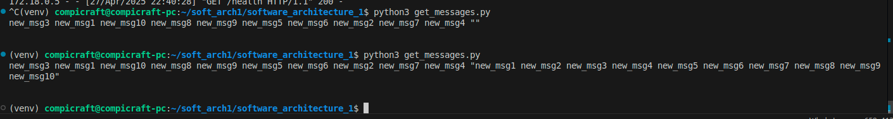
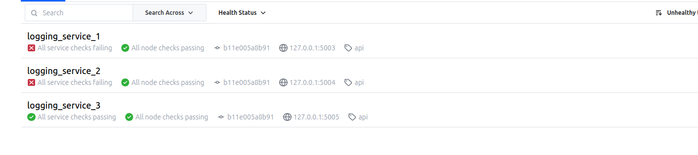
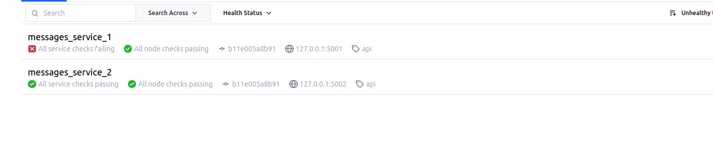
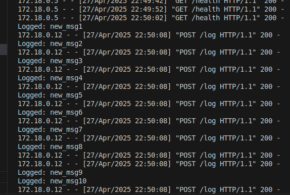
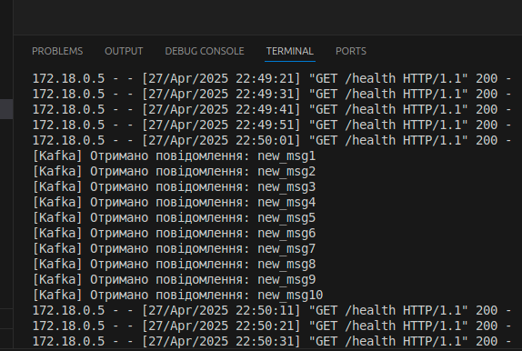

# Homework 4
## Bohdan Ozarko

### Installation
```git clone https://github.com/Compi-Craft/software_architecture_1.git```
```git checkout micro_consul```
### Prerequisites
<mark>DOCKER</mark><br>

### Usage

Run all services<br>
```chmod +x run.sh```<br>
```run.sh```<br>


1. Отримуємо набір контейнерів


1. Список сервісів у consul<br>

1. Записуємо 10 повідомлень через fill_messages.py скрипт<br>


    Фасад сервіс<br>
    

    Логи logging сервісів<br>
    
    
    

    Розподіл між нодами hazelcast<br>
    

    Логи messages сервісів<br>
    

    GET запит<br>
    

1. Вимкнемо два логінг сервіса та один месадж і запишемо повідомлення знову

    ```docker stop logging_service_1 logging_service_2 messages_service_1```

    
    
    
    

    Все працює як раніше
