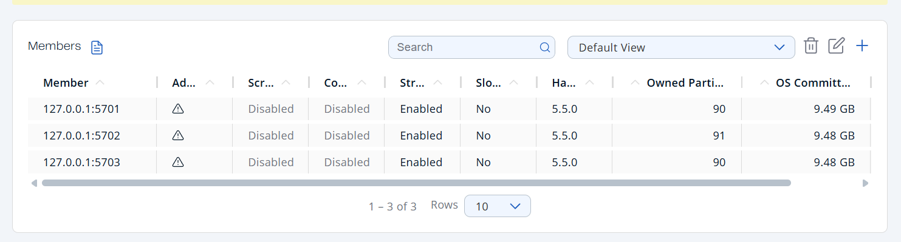
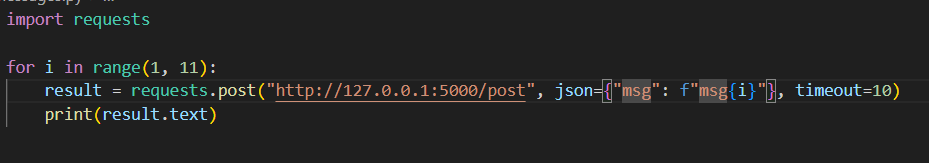
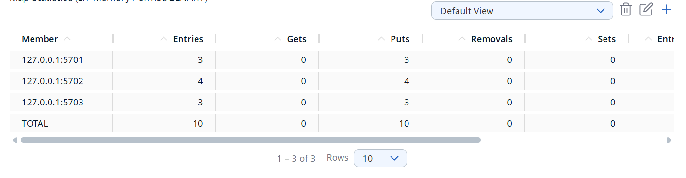
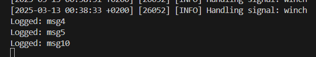
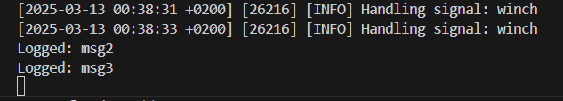
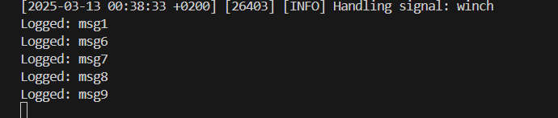
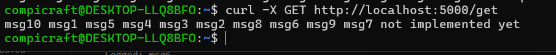
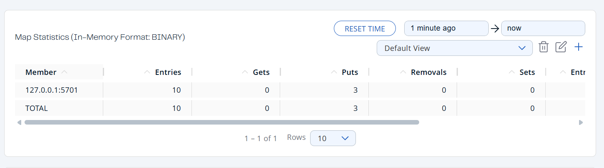
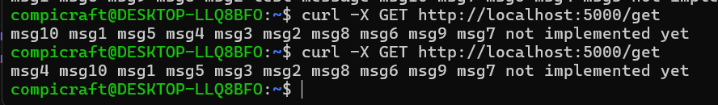

# Homework 3
## Bohdan Ozarko

### Installation
<mark>```git clone https://github.com/Compi-Craft/software_architecture_1.git```</mark>

### Prerequisites
<mark>```pip install -r requirements.txt```</mark>

### Usage

Run all services

```gunicorn -b 127.0.0.1:5001 logging_service:app```<br>
```gunicorn -b 127.0.0.1:5002 logging_service:app```<br>
```gunicorn -b 127.0.0.1:5003 logging_service:app```<br>
```python3 logging_service.py```<br>
```python3 messages_service.py```<br>

1. Отримуємо три ноди hazelcast



2. Записуємо 10 повідомлень через fill_messages.py скрипт



Отримуємо такий розподіл повідомлень



3. Звернення до кожного екземпляру logging_service відбувалося випадковим чином:




4. Прочитаємо через curl повідомлення

```curl -X GET http://localhost:5000/get```

Отримаємо:


5. Вимкнемо екземпляри logging_service на портах 5002 і 5003:


Тепер всі записи знаходяться в одній ноді

Прочитаєм їх через GET запит

Все працює як раніше