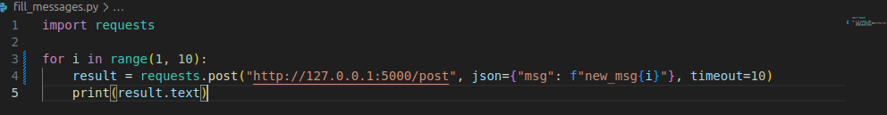
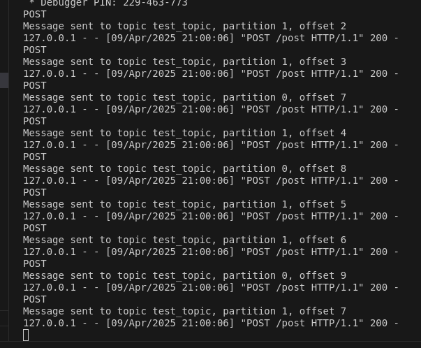
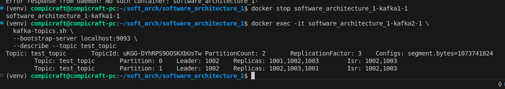
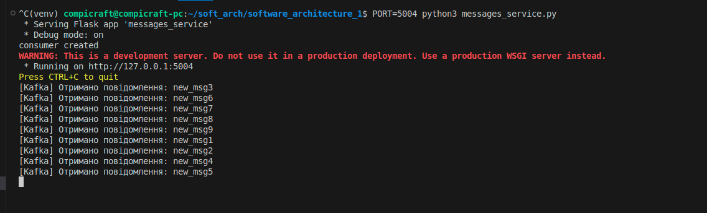
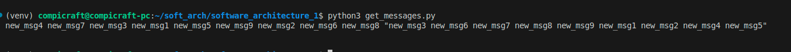

# Homework 3
## Bohdan Ozarko

### Installation
<mark>```git clone https://github.com/Compi-Craft/software_architecture_1.git```</mark>

### Prerequisites
<mark>```pip install -r requirements.txt```</mark><br>
Also docker
### Usage

Run all services<br>
```docker compose up -d```<br>
```gunicorn -b 127.0.0.1:5001 logging_service:app```<br>
```gunicorn -b 127.0.0.1:5002 logging_service:app```<br>
```gunicorn -b 127.0.0.1:5003 logging_service:app```<br>
```python3 logging_service.py```<br>
```PORT=5004 python3 messages_service.py```<br>
```PORT=5005 python3 messages_service.py```<br>

1. Отримуємо три ноди hazelcast


2. Отримуємо наступну конфігурацію Kafka


1. Записуємо 9 повідомлень через fill_messages.py скрипт


Отримуємо такий розподіл повідомлень у  message services


4. Зробимо get request, отримуємо набір повідомлень з випадково обраного message service

### Перевірка відмовостійкості
1. Вимикаємо message services

2. Надсилаємо 9 повідомлень


3. Вимикаємо одного з лідерів

4. Вмикаємо message service і дивимось чи зчитає

Перший запущений сервіс все зчитав і зберіг у пам'ять, отже реплікація працює
