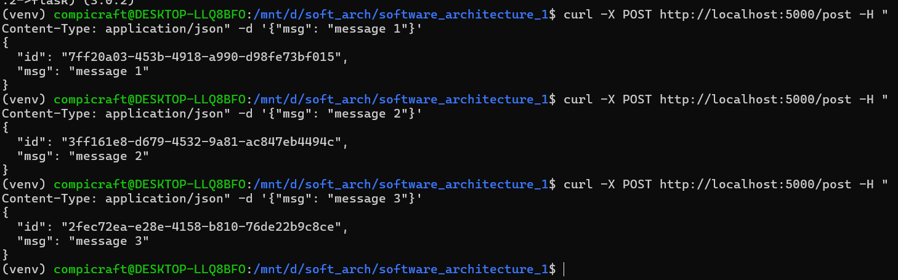
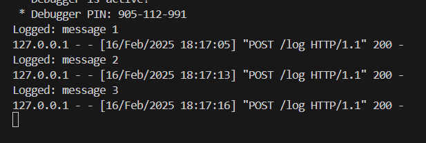
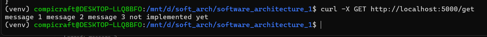
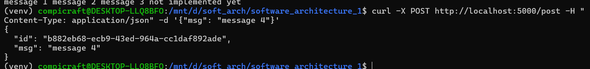
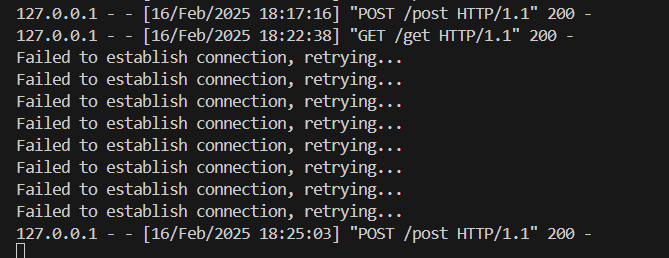
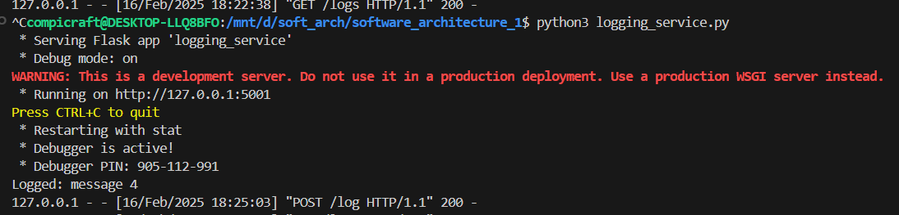
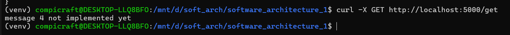
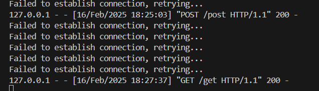
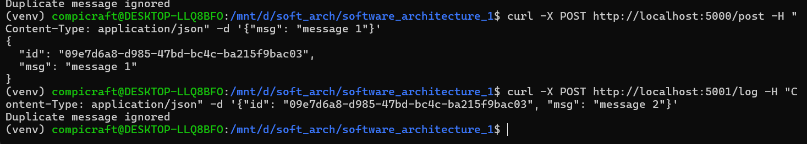

# Homework 1
## Bohdan Ozarko

### Installation
<mark>```git clone https://github.com/Compi-Craft/software_architecture_1.git```</mark>

### Prerequisites
<mark>```pip install -r requirements.txt```</mark>

### Usage

Run all services

```python3 facade_service.py```<br>
```python3 logging_service.py```<br>
```python3 messages_service.py```<br>

Post request to facade service

```curl -X POST http://localhost:5000/post -H "Content-Type: application/json" -d '{"msg": <your_message_here>}'```



Logging service console



Get request to facade service



### Additional task: retry and deduplicate mechanisms

Retry mechanism if logging service is off for post request



Facade service console



Logging service console



Retry mechanism if logging or messaging service is off for get request



Facade service console



Deduplicate protection for logging service example (we will use direct post request to logging service with existing uuid)

```curl -X POST http://localhost:5001/log -H "Content-Type: application/json" -d '{"id": "EXISTING_UUID", "msg": "message 5"}'```

